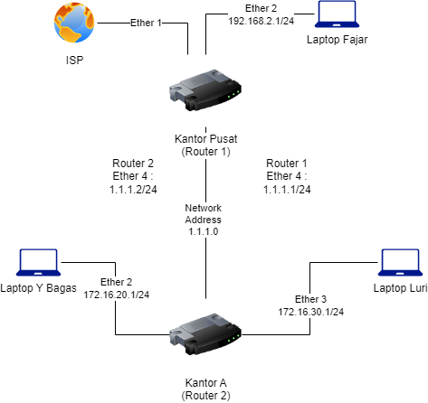

# Universitas Esa Unggul Kampus Tangerang
# UTS Jaringan Komputer Lanjut
## Kelompok 4 
1. Dian Fajar Septianto (20200801194)
2. Luri Sesy Apriyani (20200801155)
3. Yohanes Bagas Ari Widatama (20200801179)

## Router 1 Mikrotik Config File
- Config exported file : router1.rsc
- Config backup file : Kantor Pusat-20231116-1608.backup
## Router 2 Mikrotik Config File
- Config exported : router-2.rsc
- Config backup file : Kantor-A-20231116-1608.backup

## Metode yang Digunakan
Dynamic routing menggunakan OSPF

## Gambaran Implementasi Studi Kasus

  

